# Interprètes du Docteur
## Les visages du Seigneur du Temps

Au fil des années, plusieurs acteurs ont incarné le Docteur :
- William Hartnell
- Patrick Troughton
- Jon Pertwee
- Tom Baker
- Peter Davison
- Colin Baker
- Sylvester MCcoy
- Paul McGann
- John Hurt
- Christopher Eccleston
- David Tennant  
- Matt Smith  
- Peter Capaldi  
- Jodie Whittaker
- David Tennant (again)
- Ncuti Gatwa  

# Interprètes du Docteur
## Les visages du Seigneur du Temps

|  |  | 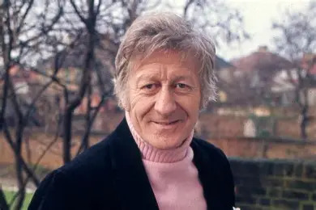 |  |
|:--:|:--:|:--:|:--:|
| William Hartnell | Patrick Troughton | Jon Pertwee | Tom Baker |

| 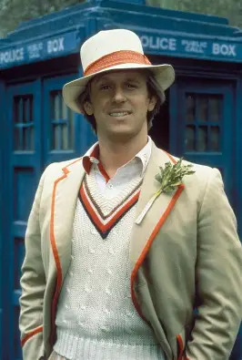 | 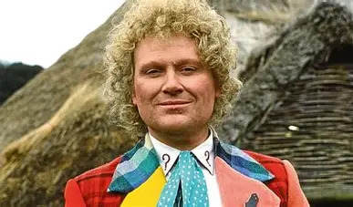 | 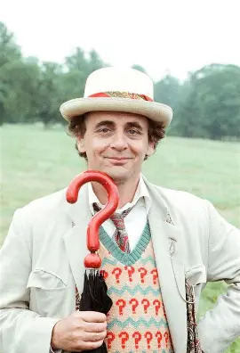 | 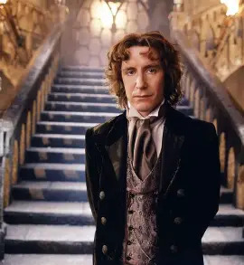 |
|:--:|:--:|:--:|:--:|
| Peter Davison | Colin Baker | Sylvester McCoy | Paul McGann |

| 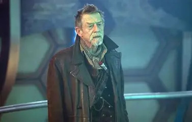 | 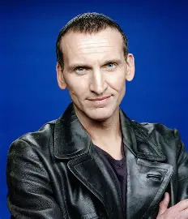 | 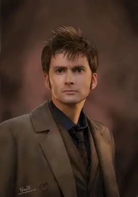 | 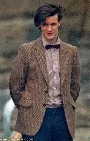 |
|:--:|:--:|:--:|:--:|
| John Hurt | Christopher Eccleston | David Tennant | Matt Smith |

| 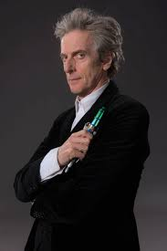 | 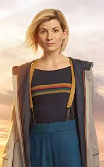 | 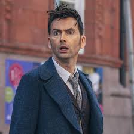 | 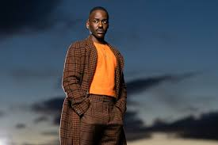 |
|:--:|:--:|:--:|:--:|
| Peter Capaldi | Jodie Whittaker | David Tennant (again) | Ncuti Gatwa |

---

### Navigation
- [Accueil](index.md)
- [Synopsis de Docteur Who](synopsis.md)
- [Création de la série](creation.md)
- [Actualités](actualites.md)
